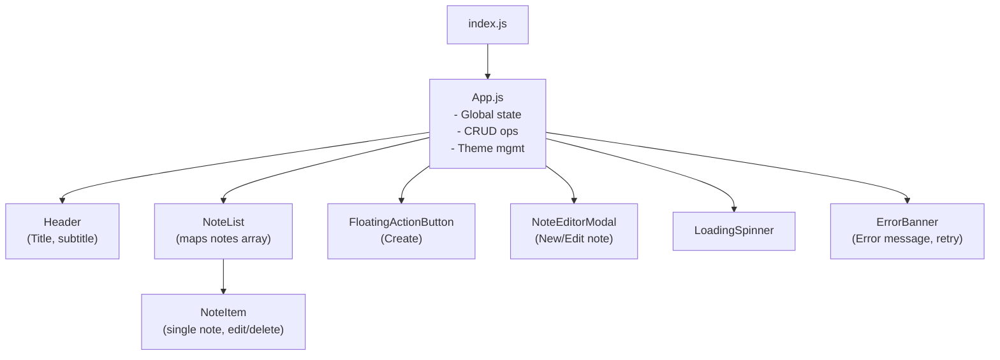
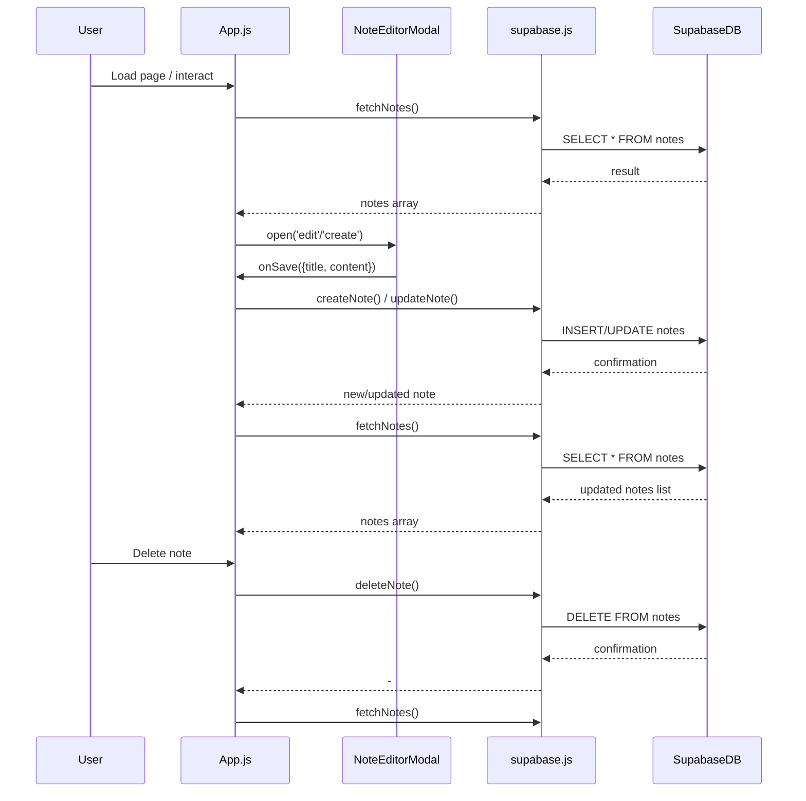
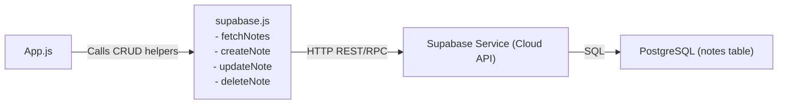

# Component & Architecture Diagrams: NoteEase (notes_frontend)

## Component Hierarchy Diagram (Mermaid)

## Data Flow & CRUD Operations Diagram (Mermaid)

## Supabase Integration Diagram (Mermaid)

